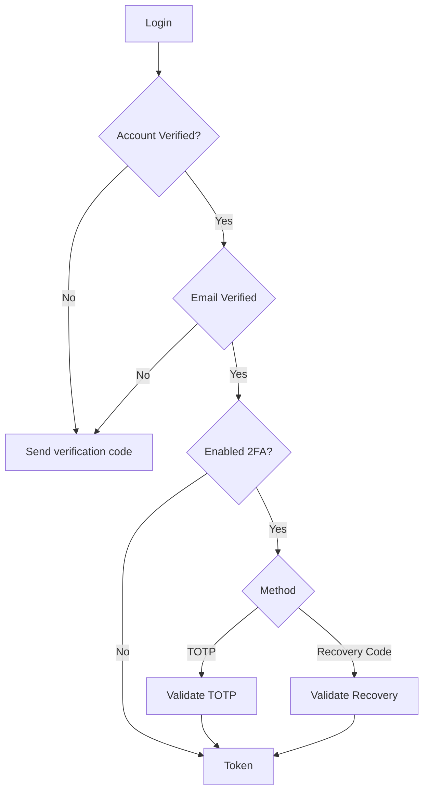
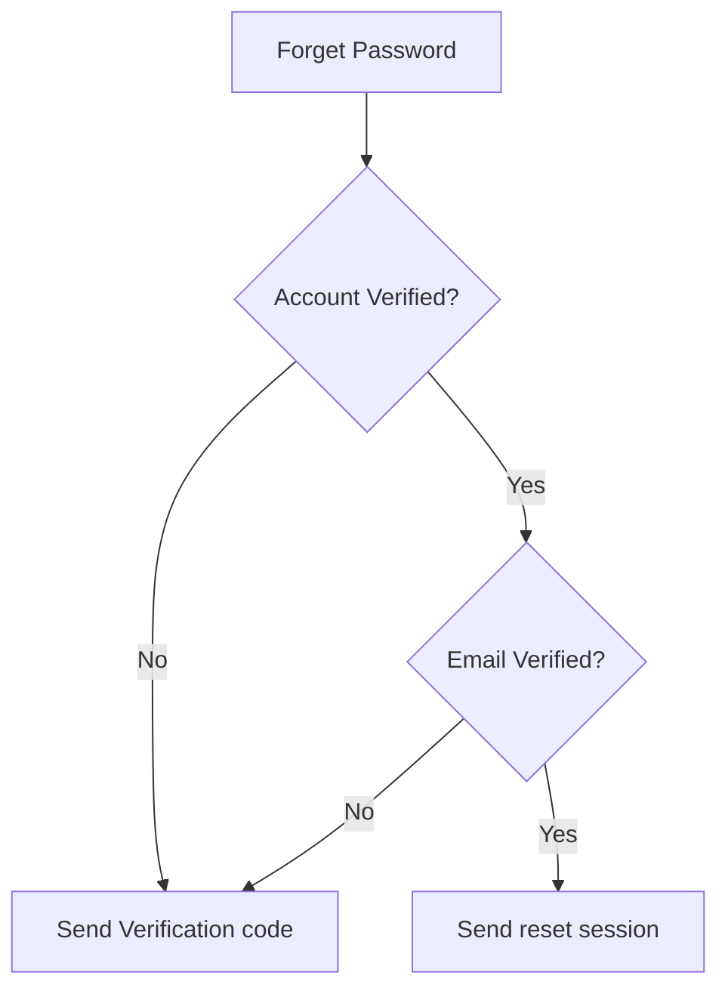
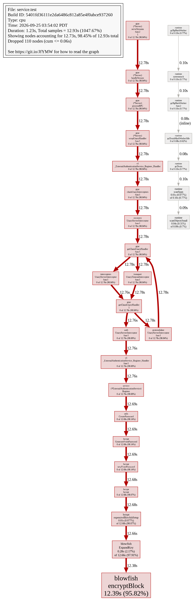
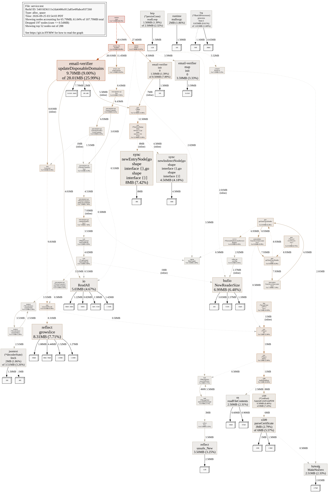
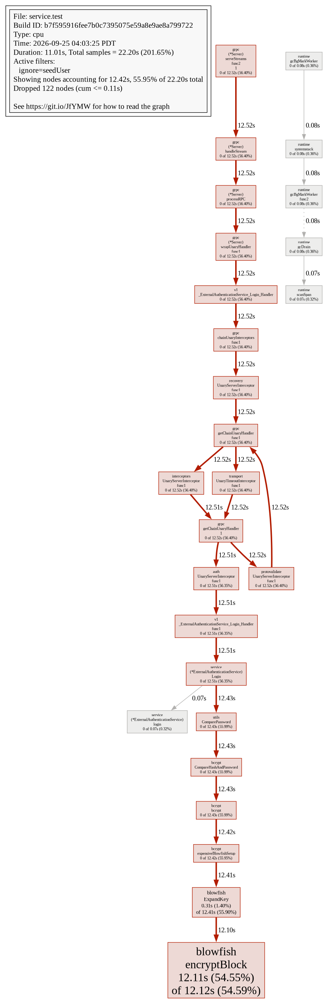
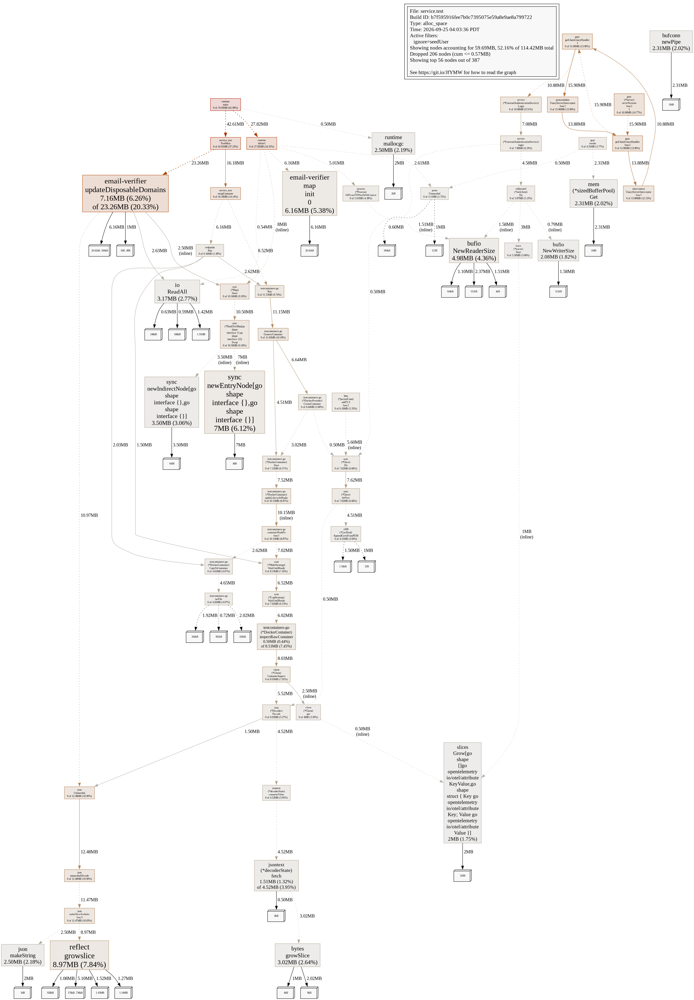
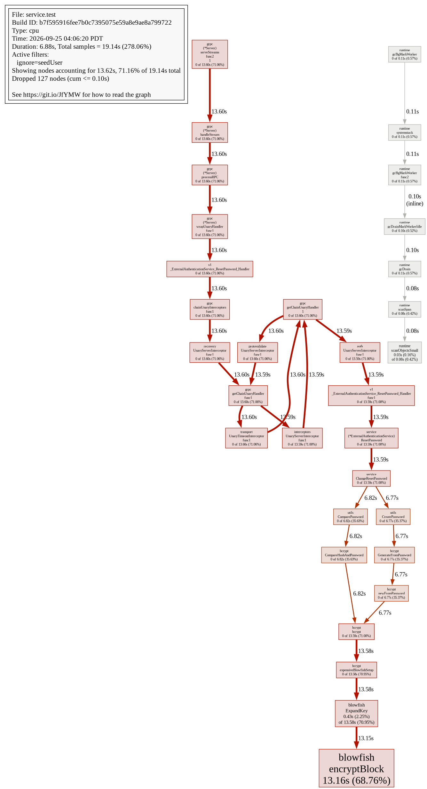
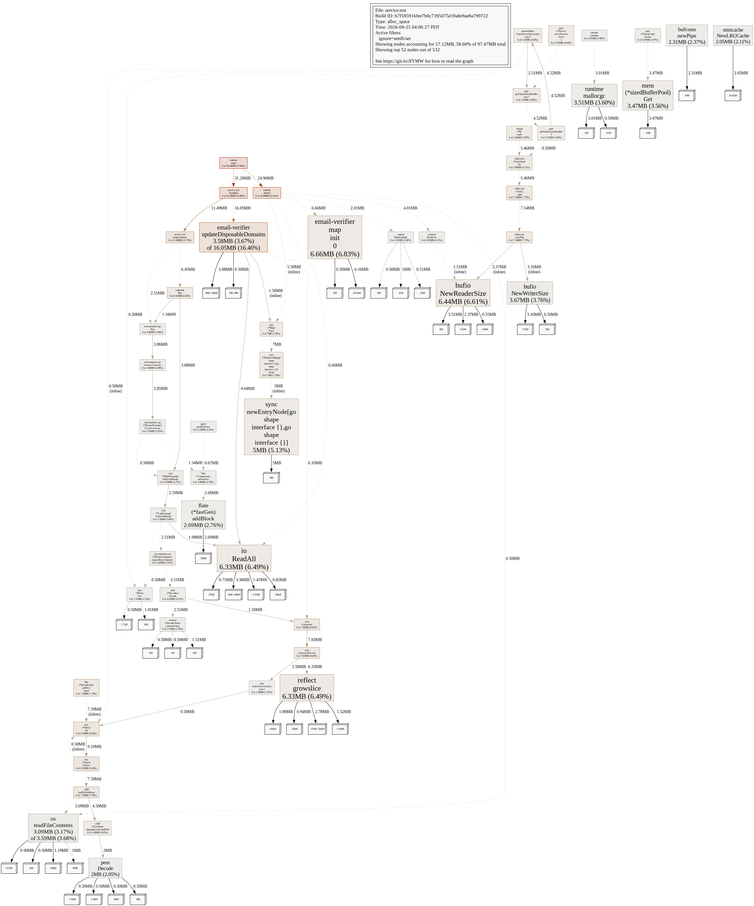

# Authentication Microservice

###### Design and Developed by [Anish Neupane](https://neupaneanish.com.np)

--- 

## Overview

Distributed Authentication Microservice with Go, gRPC, PostgreSQL, and Valkey.

---

## Features

- gRPC APIs
- Protocol Buffers (buf.build)
- SQLc query
- JWT authentication
- TOTP based 2FA
- PostgreSQL Database
- Valkey for caching
- Rate Limiter
- OpenTelemetry observability
- Dockerized testing (testcontainers)
- Benchmarks, E2E
- Background Worker (asynq)

---

## Technologies Stack

| Technology                                                |                                                                                                       | Description                                                                      |
|:----------------------------------------------------------|:-----------------------------------------------------------------------------------------------------:|:---------------------------------------------------------------------------------|
| [**Go**](https://go.dev)                                  |                               | Core application logic                                                           |
| [**gRPC**](https://grpc.io)                               |                           | High-performance RPC framework                                                   |
| [**PostgreSQL**](https://postgresql.org)                  |               | Primary relational database                                                      |
| [**JWT**](https://jwt.io)                                 |                             | Secure authentication tokens                                                     |
| [**Valkey**](https://valkey.io)                           |                       | High-performance data structure store                                            |
| [**Docker**](https://docker.com)                          |                       | Containerization and deployment                                                  |
| [**Test Containers**](https://testcontainers.com)         |       | Orchestrates real PostgreSQL and Valkey Docker instances inside automated tests. |
| [**GitHub Actions**](https://github.com/features/actions) |       | CI/CD automation pipelines                                                       |
| [**OpenTelemetry**](https://opentelemetry.io)             |         | Observability and telemetry framework                                            |
| [**Google Authenticator**]()                              |  | Two-Factor Authentication (2FA) via TOTP                                         |

---

## Endpoints

### External

- [X] Register
- [X] Login
- [X] Forget Password
- [X] Verification
- [X] Reset Password
- [X] Resend
- [X] Refresh

### Gateway

- [X] PasswordVerification
- [X] PasswordSessionVerification
- [X] Resend
- [X] ChangePassword
- [X] ConfirmTwoFactor
- [X] Role
- [ ] Profile
- [X] Logout
- [X] LogoutAll

---

## Environments

### Server

|        Name         |               Default                |                                   Options                                    |
|:-------------------:|:------------------------------------:|:----------------------------------------------------------------------------:|
|    DATABASE_HOST    |                                      |                                                                              |
|    DATABASE_NAME    |                                      |                                                                              |
|    DATABASE_USER    |                                      |                                                                              |
|  DATABASE_PASSWORD  |                                      |                                                                              |
|    DATABASE_PORT    |                `5432`                |                                                                              |
|    DATABASE_SSL     |                `True`                |                                                                              |
|     VALKEY_URL      |                                      |                                                                              |
|       JWT_KEY       |                                      |                      `ed25519` Private Key Seed Size 32                      |
|   TWO_FACTOR_KEY    |                                      |                      `ed25519` Private Key Seed Size 32                      |
|       ISSUER        |           `Anish Neupane`            |                                                                              |
|        PORT         |               `50051`                |                               `80` to `65535`                                |
|      HTTP_PORT      |                `8000`                |                               `80` to `65535`                                |
|    SERVICE_NAME     | `neupaneanish.com.np/authentication` |                                                                              |
|     ENVIRONMENT     |            `development`             |                        `development` or `production`                         |
|    TELEMETRY_URL    |                                      |                                gRPC port only                                |
|       DOMAIN        |                                      |           Naked domain (e.g., neupaneanish.com.np or example.com)            |
| DOMAIN_VERIFICATION |                                      |                Random token string generated via rand.Text()                 |
|     DOMAIN_NAME     |                                      | Prefix e.g. api (api.neupaneanish.com.np) for user to point their own domain |

```dotenv
DATABASE_HOST=
DATABASE_NAME=
DATABASE_USER=
DATABASE_PASSWORD=
DATABASE_PORT=
DATABASE_SSL=
VALKEY_URL=127.0.0.1:6379
JWT_KEY=
TWO_FACTOR_KEY=
ISSUER='Anish Neupane'
PORT=50051
SERVICE_NAME=neupaneanish.com.np/api
ENVIRONMENT=development
TELEMETRY_URL=127.0.0.1:4317
DOMAIN=neupaneanish.com.np
DOMAIN_VERIFICATION=
DOMAIN_NAME=api
```

### Worker

```dotenv
VALKEY_URL=127.0.0.1:6379
SMTP2GO_API=
SENDER_DOMAIN=neupaneanish.com.np
```

> **Note:** Server and Worker valkey should be same
---

## Flow Chart

### Login


```mermaid
flowchart TD
    A[Login] --> B{Account Verified?}
    B -->|Yes| C{Email Verified}
    B -->|No| I[Send verification code]
    C -->|No| I
    C -->|Yes| D{Enabled 2FA?}
    D -->|Yes| E{Method}
    D -->|No| F[Token]
    E -->|TOTP| G[Validate TOTP]
    E -->|Recovery Code| H[Validate Recovery]
    G --> F
    H --> F
```

### Forget Password


```mermaid
flowchart TD
    A[Forget Password] --> B{Account Verified?}
    B -->|No| E[Send Verification code]
    B -->|Yes| C{Email Verified?}
    C -->|No| E
    C -->|Yes| D[Send reset session]
```

---

## Setup, Execution & Testing

```bash
# 1. Clone the core framework engine
git clone https://github.com/neupaneanish/authentication.git
cd authentication

# 2. Initialize Git submodules
# (Note: if HTTP use git config --global url."https://github.com/".insteadOf "git@github.com:")
git submodule update --init

# 3. Generate Go code from protobuf definitions (Requires Buf CLI)
buf generate

# 4. Generate Go code from SQL queries using SQLc (Requires SQLc CLI)
sqlc generate

# 5. Execute the tests
go test -v -tags=unit ./...
go test -v -tags=integration ./...
go test -v -tags=benchmark ./...
go test -v -tags=e2e ./...

# 6. Launch the asynchronous background worker daemon
go run cmd/worker/main.go

# 7. Launch the local microservice API server
# (Note: Requires an active OpenTelemetry collector instance, e.g., SigNoz)
go run cmd/server/main.go
```

---

## Application-Layer Rate Limiting Matrix

> Note: For IP will use envoy in future

| Endpoint                                 | Layer 1 Key | Layer 1 Limit | Layer 2 Key | Layer 2 Limit |
|------------------------------------------|-------------|---------------|-------------|---------------|
| Register                                 | None        | None          | None        | None          |
| Login                                    | Email       | 5 / 5 Min     | None        | None          |
| Verification                             | Session     | 5 / 5 Min     | UserID      | 5 / 30 Min    |
| Forget Password                          | Email       | 5 / 5 Min     | None        | None          |
| Reset Password                           | Session     | 5 / 5 Min     | UserID      | 5 / 30 Min    |
| Refresh                                  | Refresh     | 2 / 15 Min    | UserID      | 4 / 30 Min    |
| Change Password                          | Session     | 5 / 5 Min     | UserID      | 5 / 30 Min    |
| Password Verification / Session Workflow | Session     | 5 / 5 Min     | UserID      | 6 / 60 Min    |

---

## Coverage ~88.10%

> Note: Metrics reflect core application logic after filtering out `main.go`, generated protobuf definitions, raw SQL
> repository code, and test helper suites.

> Coverage is done through real infrastructure PostgreSQL, Valkey, OpenTelemetry i.e. testcontainers. It doesn't have
> any mocks.

```bash
# Generate coverage
go test -race -tags=unit,integration,benchmark,e2e -coverprofile=coverage.out -coverpkg=./... ./..

# Filter out external boundaries, generated code, and tooling 
grep -v -E "cmd/|/internal/protobuf/|/internal/repository/|/tests/|/protobuf/|/database/" coverage.out > coverage.clean.out

# Export to interactive HTML for local branch analysis
go tool cover -html=coverage.clean.out -o coverage.clean.html 

# Output statement breakdown to CLI
go tool cover -func=coverage.clean.out 
```

---

## Testing Architecture (Testcontainers)

This repository uses a modern, completely containerized testing environment:

- **Integration and E2E Tests:** Used real database, valkey and telemetry instances for integration tests.
- **Benchmark Tests:** Used memory server i.e. `bufconn` instead of real server for tests.

---

## Performance & Profiling

Benchmarks were executed on:

- OS: Ubuntu Linux (WSL)
- Architecture: amd64
- CPU: Intel® Core™ i7-10750H @ 2.60GHz (12 Execution Threads)

### Benchmarks (Parallel)

Used Bcrypt **(Default Cost)** to secure sensitive fields. To see how well this gRPC server scales under heavy traffic,
ran a benchmark. Seeded users before the benchmark and utilized **ResetTimer** to capture pure execution data.

| Endpoints      | Size | Latency (ns/op) | Memory (B/op) | Heap (allocs/op) | Cryptographic Passes |
|----------------|------|-----------------|---------------|------------------|----------------------|
| Register       | 136  | 9161800         | 61382         | 637              | 1                    |
| Login          | 120  | 10219451        | 92462         | 682              | 1                    |
| Reset Password | 55   | 19387333        | 99606         | 602              | 2 (Max 6)            |

#### Security Architecture Notes:

- **Register:** 1 Bcrypt operation using `GenerateFromPassword` to hash raw password before storing in database.
- **Login:** 1 Bcrypt operation baseline (utilizes `CompareHashAndPassword` to verify the incoming credentials against
  the database record).
- **Login Two Factor:** Execution cost depends on the validation type:
    - **TOTP:** Uses 0 Bcrypt operations, relying strictly on fast, time-base SHA-1 HMAC
    - **Recovery Code:** 1 Bcrypt operation baseline `CompareHashAndPassword` upto 10 operation depend upon Recovery
      codes length.
- **Reset Password:** 2 Bcrypt operations baseline (1 `CompareHashAndPassword` to verify the active identity context + 1
  `GenerateFromPassword` to securely hash the new replacement credentials). If a user has a fully populated password
  history, the endpoint dynamically invokes up to 4 additional historical comparisons to prevent credential reuse,
  scaling total passes to a maximum of 6.

#### CPU Profile Graph

This execution chart was exported using `go tool pprof` during a standard benchmark run:

#### Register

```bash
go test -bench=Register -benchmem -cpuprofile=register_cpu.pprof -memprofile=register_mem.pprof -tags=benchmark ./internal/service

go tool pprof -png register_mem.pprof > docs/images/bench_register_mem.png

go tool pprof -png register_cpu.pprof > docs/images/bench_register_cpu.png
```

##### CPU



##### Memory



#### Login

```bash
go test -bench=Login -benchmem -cpuprofile=login_cpu.pprof -memprofile=login_mem.pprof -tags=benchmark ./internal/service

go tool pprof -png -ignore="seedUser" login_mem.pprof > docs/images/bench_login_mem.png

go tool pprof -png -ignore="seedUser" login_cpu.pprof > docs/images/bench_login_cpu.png
```

##### CPU



##### Memory



#### Reset Password

```bash
go test -bench=ResetPassword -benchmem -cpuprofile=reset_password_cpu.pprof -memprofile=reset_password_mem.pprof -tags=benchmark ./internal/service

go tool pprof -png -ignore="seedUser" reset_password_mem.pprof > docs/images/bench_reset_password_mem.png

go tool pprof -png -ignore="seedUser" reset_password_cpu.pprof > docs/images/bench_reset_password_cpu.png
```

##### CPU



##### Memory



---

## [License](LICENSE)